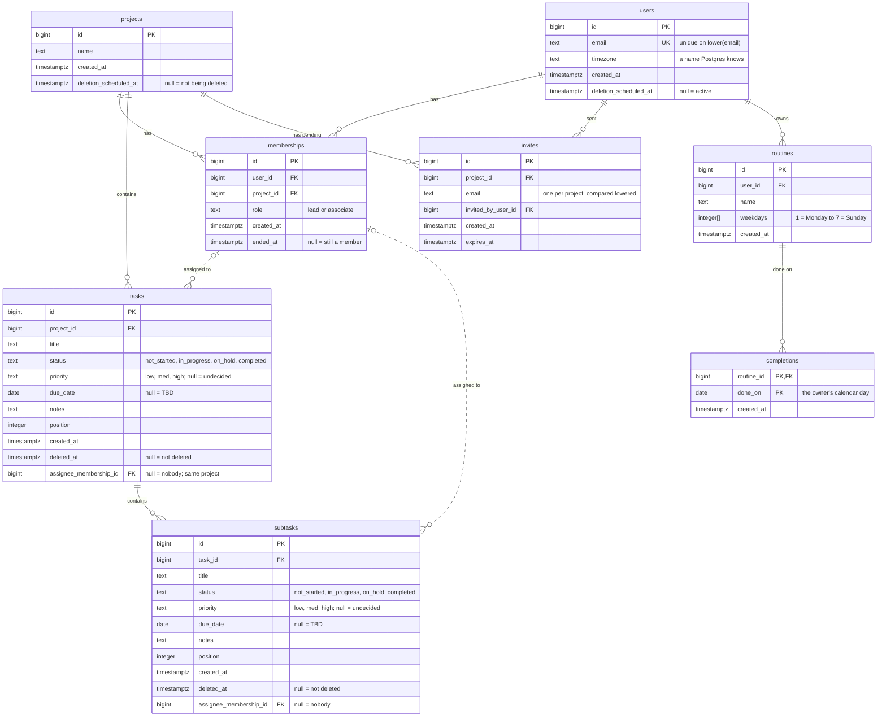

# Taskco — schema diagram

The eight tables as of migration 020, and how they point at each other. The rules each column carries
(checks, partial indexes, the views) are in the
[current schema appendix](./reference.md#appendix--current-schema); this page is for seeing the shape.

GitHub draws the diagram below. In an editor, it needs a Mermaid preview extension.

## How to read it

One example, followed through every step: **a task and the membership it is assigned to.**

### 1. A box is a table

`tasks` and `memberships` are boxes. Each row inside is a column: type first, then name.

### 2. PK, FK, UK

`PK` is the primary key, the column that names the row. `FK` is a foreign key, a column that holds
another table's `id`. `tasks.assignee_membership_id` is an `FK`: it holds a `memberships.id`.
`UK` is unique: no two rows may share it.

### 3. A line is a foreign key

The line between `memberships` and `tasks` is that `assignee_membership_id` column, drawn.

### 4. The ends of a line say "how many"

Read each end as the answer to "how many of *this* table can one row on the other side have?"

| End | Means |
|---|---|
| `\|\|` | exactly one |
| `o\|` or `\|o` | zero or one |
| `o{` or `}o` | zero or more |

At the `memberships` end: zero or one. One task has at most one assignee, and may have none.
At the `tasks` end: zero or more. One membership can be assigned any number of tasks, or none.

### 5. Solid or dashed

Solid: the foreign key column is `not null`, so the link is always there. Dashed: the column is
nullable, so the link can be empty. The two assignee lines are the only dashed ones.

## What the picture leaves out

- **Check constraints:** the comments name the allowed values, but the diagram cannot enforce
  or show the rule itself.
- **Partial unique indexes:** "one active membership per person and project" and "one Lead per
  project" do not appear anywhere in the boxes.
- **The composite foreign key:** a task's assignee must be a membership *in the task's project*.
  The line looks the same as the subtask one, which has no such check.
- **Views and functions:** `visible_tasks`, `visible_subtasks`, `user_today`, `is_known_timezone`.
- **`schema_migrations`:** the runner's own table, not part of the app.

**When a migration adds a table, a column or a foreign key, update this page too.** Nothing does it
for you.
